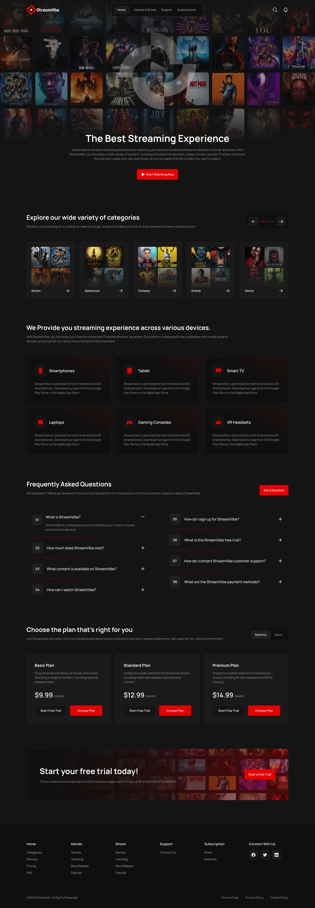
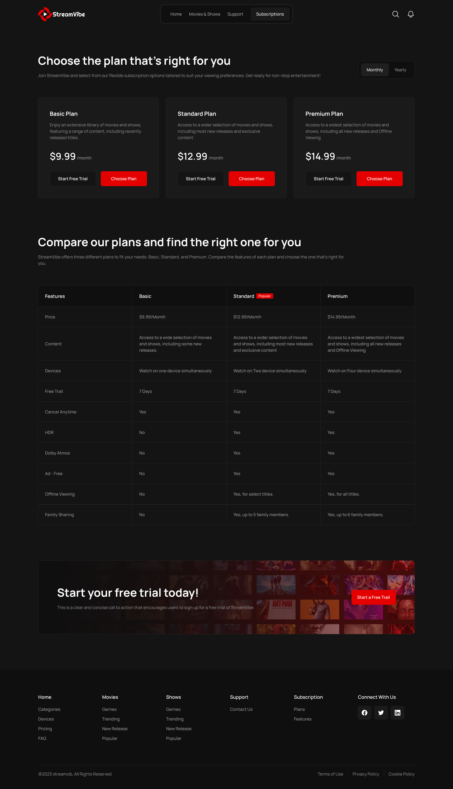
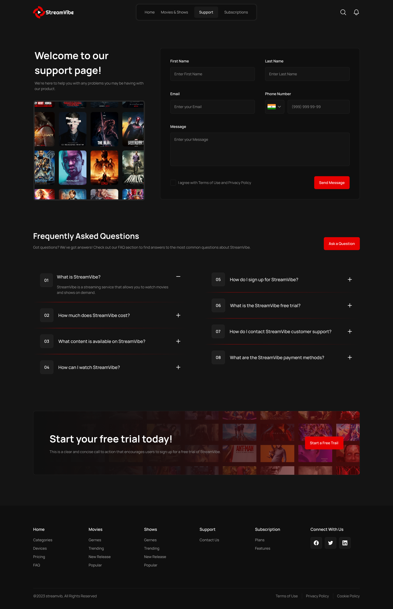

---

# Stream Vibe

**Stream Vibe** - это многостраничное приложение (MPA), разработанное с использованием современного фронтенд-стека: **Minista (обёртка над Vite)**, **SCSS (Sass)** и **Vanilla JavaScript**.

Проект демонстрирует практическое применение статической генерации сайтов (SSG) с поддержкой JSX-шаблонов, а также реализацию сложных интерфейсных компонентов без применения тяжёлых фреймворков.

---

## Основные возможности

* **Адаптивная навигация**: мобильное меню (бургер), табы.
* **UI-компоненты**: кастомный селект, маски для полей ввода.
* **Медиа**: собственный видеоплеер.
* **Интерактив**: несколько слайдеров для контента.
* **Оптимизация**: сборка через Vite + статическая генерация страниц.

---

## Технологический стек

* **HTML5 / CSS3 / JavaScript (ES6+)** - реализация без фреймворков.
* **Методология БЭМ** - стандартизация именования классов.
* **Sass (SCSS)** - модульные и поддерживаемые стили.
* **Vite + Minista** - сборка, hot-reload, статическая генерация.
* **NPM-библиотеки** - только для необходимых задач (слайдеры, маски).

---

## Целевая аудитория

* **Junior-разработчики**: практика с нативным JavaScript и современным билд-стеком перед изучением React/Vue/Angular.
* **Middle/Senior-разработчики**: знакомство с Minista и подходами к статической генерации многостраничных приложений.
* **Фронтенд-инженеры любого уровня**: быстрый и удобный способ разработки MPA с использованием JSX-шаблонов.

---

## 🚀 Запуск и сборка

```bash
# Установка зависимостей
npm install

# Запуск dev-сервера
npm run dev

# Сборка проекта
npm run build

# Локальный просмотр собранной версии
npm run preview

# Деплой на GitHub Pages
npm run deploy
```

---

##  Деплой

Проект развёрнут на **GitHub Pages**:
👉 [Stream Vibe Demo](https://dianakurt.github.io/stream-vibe/)

---
## Скриншоты интерфейса

### Главная страница


### Фильмы и сериалы


### Подписки


### Поддержка


